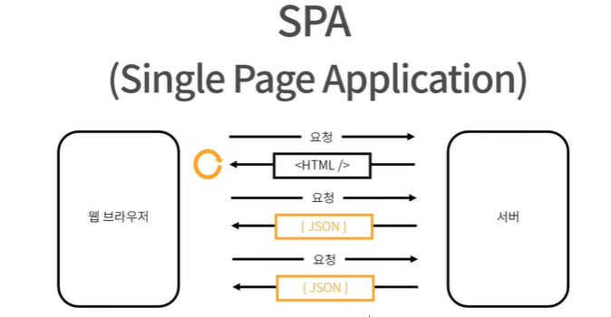

# 개발 환경

## 학습 키워드

* Node.js
* NPM(Node Package Manager)
  * package.json / package-lock.json
  * node\_modules
  * npx
* ES Modules vs CommonJS

## TypeScript + React + Jest + ESLint + Parcel(번들러, 빌드tool, 만능tool) 개발 환경 추천 세팅

작업 폴더 준비

* mkdir my-all
* cd my-app

VSCode 열기

* code .
* webstorm . (웹스톰)

npm 패키지 준비

* npm init
* npm init -y (package.json 생성)
* name은 kebab-case, Lisp-case
* version은 semantic versioning
  * major.minor.patch

.gitignore 세팅

* touch .gitignore
* node\_modules/
* dist/
* github/gitignore 혹은 vscode에서 .gitignore을 생성하면 편리

타입스크립트 설정

* npm i -D typescript
  * \-D 옵션은 package.json의 devDependencies에 설치된다.
  * 개발 환경에서만 사용되는 툴
  * 과거에는 npm i --save-dev
* npx tsc --init
  * node\_modules/.bin/tsc --init 명령어와 같다.
  * npx는 node\_modules에 해당하는 패키지가 설치되어 있으면 찾아서 실행, 설치되어 있지 않으면 npm 패키지들을 캐시하는 곳에 다운 받아서 설치하지 않아도 사용할 수 있도록 해준다.
  * "jsx" : "react-jsx" 설정을 맞춰준다.
    * .tsx 파일을 사용 가능하게 함
    * import React를 하지 않아도 사용 가능하게 함

ESLint 설정

* npm i -D eslint
* npx eslint --init
* env에 jest:true를 미리 잡아줄 것.
* .eslintignore 작성

리액트 설치

* npm i react react-dom
* npm i -D @types/react @types/react-dom

테스팅 도구 설치

* npm i -D jest @types/jest @swc/core @swc/jest\
  jest-environment-jsdom\
  @testing-library/react @testing-library/jest-dom

jest.config.js 설정

* 성능을 위해 테스트에서 SWC를 사용할 수 있도록 세팅

Parcel 설치

* npm i -D parcel
* package.json scripts 수정

***

## 만들어진 개발 환경 (React)

* CRA (Create-React-App)
  * npx create-react-app my-app --template typescript
* Vite
  * yarn create vite
* CNA (Create-Next-App)
  * npx create-next-app@latest


TypeScript + React + Jest + ESLint + Parcel 개발 환경 세팅


<figure><figcaption></figcaption></figure>

<figure><figcaption></figcaption></figure>

<figure><figcaption></figcaption></figure>

<figure><figcaption></figcaption></figure>

<figure><figcaption></figcaption></figure>

<figure><figcaption></figcaption></figure>

<figure><figcaption></figcaption></figure>

<figure><figcaption></figcaption></figure>

<figure><figcaption></figcaption></figure>

<figure><figcaption></figcaption></figure>

<figure><figcaption></figcaption></figure>

1. [fnm (Fast Node Manager)](https://github.com/Schniz/fnm)
2. [parcel](https://betterprogramming.pub/all-you-need-to-know-about-parcel-dbe151b70082)
3. [.bin](https://simsimjae.medium.com/%ED%8C%A8%ED%82%A4%EC%A7%80-%EC%95%88%EC%97%90%EB%8A%94-bin%EC%9D%B4%EB%9D%BC%EA%B3%A0%ED%95%98%EB%8A%94-%EC%88%A8%EA%B9%80-%ED%8F%B4%EB%8D%94%EA%B0%80-%EC%A1%B4%EC%9E%AC%ED%95%9C%EB%8B%A4-%EC%9D%B4-%ED%8F%B4%EB%8D%94%EB%8A%94-%EB%AD%90%EB%95%8C%EB%A7%A4-%EC%9E%88%EB%8A%94%EA%B1%B4%EC%A7%80-%EA%B6%81%EA%B8%88%ED%95%B4%EC%84%9C-%EC%B0%BE%EC%95%84%EB%B3%B4%EC%95%98%EB%8B%A4-8257ddaa1a7e)
4. [why should use SWC](https://medium.com/@KasraKhosravi/why-you-should-use-swc-and-not-babel-45b9dd15d058)
5. [An In-Depth Explanation of package.json's Dependencies](https://betterprogramming.pub/package-jsons-dependencies-in-depth-a1f0637a3129)
