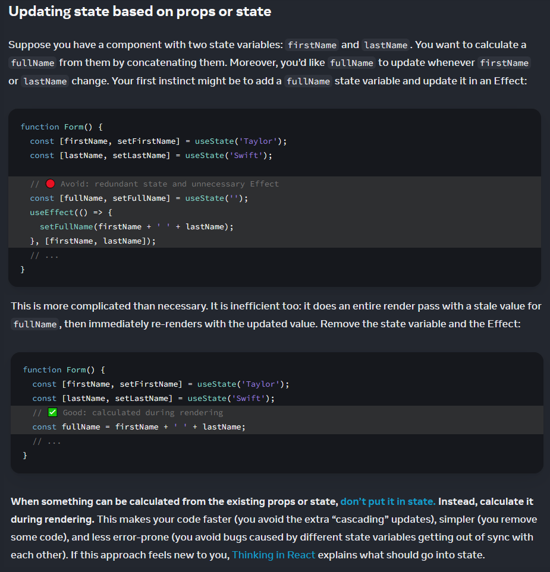

# Routes

#### 학습 키워드

* 라우터란?
* React Router
  * Browser Router
  * Route
  * Memory Router

## MPA vs SPA

#### MPA

MPA는 Multiple Page Application으로, 여러 개로 구성된 웹 애플리케이션을 말한다. 새로운 화면을 요청할 때마다, 서버에서 준비한 화면을 보여줄 수 있다

<figure><figcaption></figcaption></figure>

**MPA**의 단점이 있다.\
1\. 새로운 페이지를 받을 때마다 전체 페이지를 랜더링해야 하기 때문에 사용자가 이용하고 있는 상태를 유지하기가 어렵다.\
2\. 바뀌지 않는 부분까지 새롭게 불러와서 보여주기 때문에 불필요한 로딩이 발생합니다.

그래서 리액트는 처음 요청 시에 딱 한 페이지만 보여주고, 변경 사항이 있는 부분만 새로 받아와 로딩하는 방식을 취하고 있다

#### SPA

SPA는 한 개의 페이지로 구성된 애플리케이션

<figure><figcaption></figcaption></figure>

웹 페이지는 홈, 게시판, 메인화면 여러개 페이지가 존재하는데, 어떻게 한가지 페이지로 여러 페이지를 대신할 수 있을까?\
서버에서 사용자에게 제공하는 페이지는 하나지만, 다른 주소, 다른 화면을 보여주는 **라우팅**을 통하여 구현할 수 있고, 이를 가능하도록 `/Home.js`, `/Board.js`와 같이 다양하게 라우팅 페이지를 구현할 수 있다

## React Router

\|  [React Router](https://reactrouter.com/en/main)

## Routes

\|  [Routes](https://reactrouter.com/en/main/components/routes)

\|  [Route](https://reactrouter.com/en/main/route/route)

#### 라우터 설치

<figure><figcaption><p>실제로 나가야 하니 -d 안붙임</p></figcaption></figure>

#### Router - element, path

<figure><figcaption><p>element 받음, path 받음</p></figcaption></figure>

#### 간단히 코드 옮기기

```typescript
import { Routes, Route } from 'react-router-dom';

function App() {
  return (
    <div>
      <Header />
      <main>
        <Routes>
          <Route path="/" element={<HomePage />} />
          <Route path="/about" element={<AboutPage />} />
        </Routes>
      </main>
      <Footer />
    </div>
  );
}
```

<figure><figcaption><p>App에서 잡아줌</p></figcaption></figure>

#### 브라우저 라우터 내려주기

\|  [BrowserRouter](https://reactrouter.com/en/main/router-components/browser-router) - web browser 화면에서 씀. Main.tsx 에서 처리

```typescript
import { BrowserRouter } from 'react-router-dom';

root.render((
  <BrowserRouter>
    <App />
  </BrowserRouter>
));
```

#### 한 세트

<figure><figcaption></figcaption></figure>

### \[테스트 환경]

#### 테스트 코드에선 메모리 라우터 사용

\|  [MemoryRouter](https://reactrouter.com/en/main/router-components/memory-router)

```typescript
import { MemoryRouter } from 'react-router-dom';

describe('App', () => {
  function renderApp(path: string) {
    render((
      <MemoryRouter initialEntries={[path]}>   //한 세트
        <App />                       //browser에서는 위치가 어디다 라는걸 URL로 알려주는데
      </MemoryRouter>   //memory에서는 위치가 없기에 initialEntries초기엔트리로 잡아줌(배열로)
    ));
  }
	
  context('when the current path is “/”', () => {
    it('renders the home page', () => {
      renderApp('/');                //경로가 '/' 면 homepage 그려줘

      screen.getByText(/Hello/);            //react testing library있는걸로 테스트
    });                            //머머가 잇는지 정확히 잡아 주기 위해서 getByText()
  });
	
  context('when the current path is “/about”', () => {
    it('renders the about page', () => {
      renderApp('/about');

      screen.getByText(/About/);    //test실패: about이 여러개 떠서
    });
  });
});
```


